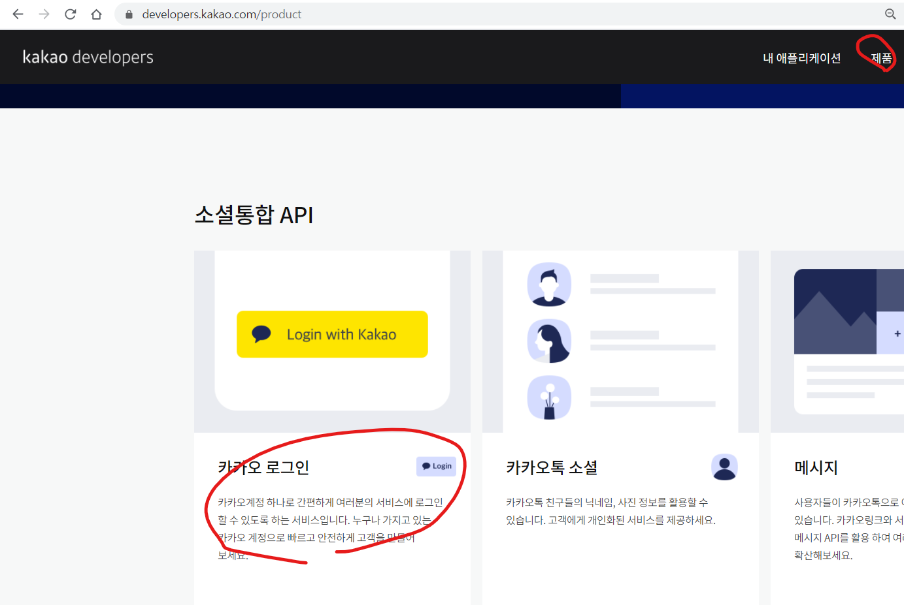
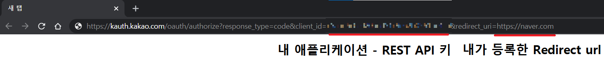
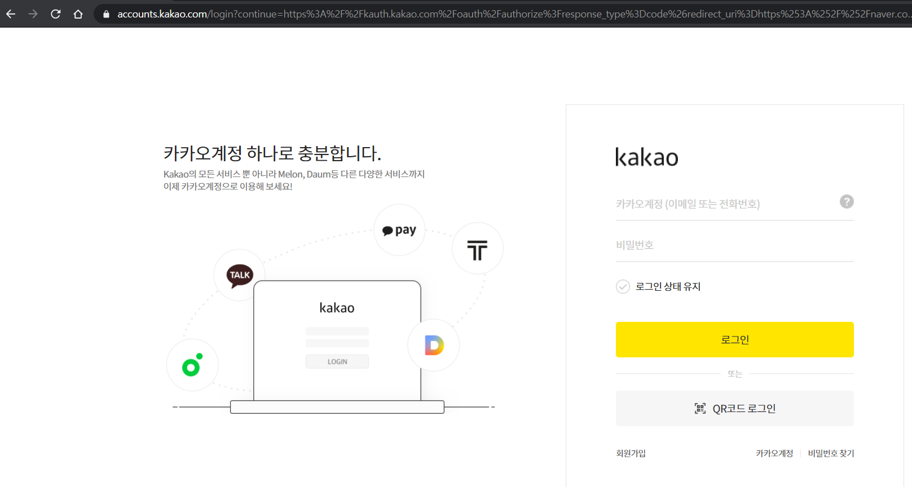
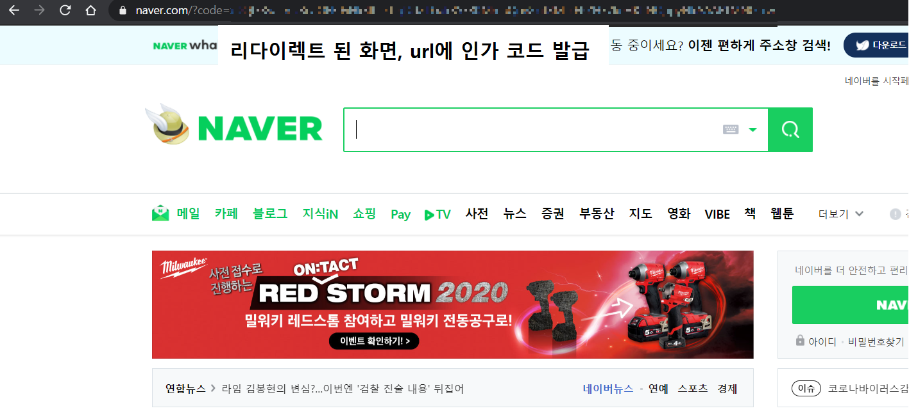
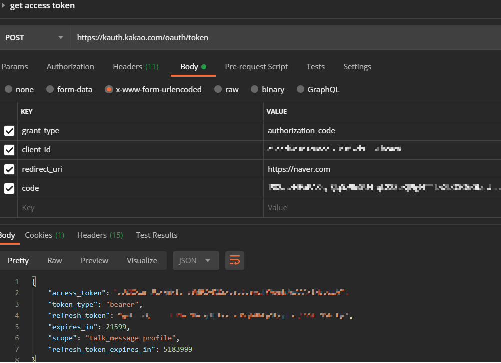

# 카카오 Developer 이용해서 나에게 메시지 보내기 2 - 카카오 로그인

1. 제품 - 카카오 로그인

   

   * [레퍼런스 문서](https://developers.kakao.com/docs/latest/ko/kakaologin/common)
   * [REST API 문서](https://developers.kakao.com/docs/latest/ko/kakaologin/rest-api)

2. 인가 코드 받기

   * 인가 코드 받기는 카카오 로그인을 시작하는 단계로써, 카카오 로그인 동의 화면을 호출 후 사용자 동의를 거쳐 인가 코드를 발급을 요청하는 API이다.

   * 카카오 로그인 👉 로그인 👉 동의 👉 redirect url로 인가 코드 발급

     ```
     https://kauth.kakao.com/oauth/authorize?response_type=code&client_id={REST_API_KEY}&redirect_uri={REDIRECT_URI}
     ```

   * 
     
* 반복 작업하면 세션이 남게 되므로 로그인 창이 나오질 않는다. 그래서 시크릿 모드로 하는걸 추천
  
   * 
     
     * 계정, 패스워드 입력 후 로그인
   * 
     
     * 인가 코드 따로 저장
     * 인가 코드 - P82aLzHFoPA3sy-SJq5z9le5U4_qL22ZeKjPigNTT-LvXLQSO6GbqU-aIk2xrPl9_p0WTQopyWAAAAF1MSaIdQ

3. 토큰 받기

   * 인가 코드만으로는 카카오 로그인이 완료되지 않으며, 토큰 받기까지 마쳐야 카카오 로그인을 정상적으로 완료할 수 있다.
   * 필수 파라미터 값들을 담아 POST로 요청, 요청 성공시 응답은 JSON 객체로 redirect URI에 전달되며 'Access token'과 'Refresh token'값과 타입, 초 단위로 만료 시간을 포함한다.
     * Access token의 만료시간은 REST API 기준으로 6시간이고, Refresh token의 만료시간은 2달이다.
   * POST방식으로 요청해야하기 때문에 자바 RestTemplate를 이용하여 요청하는 것은 나중에 해보고 우선 Postman으로 수행

   * 
   * access token - TrOsfXFph71wl7L64EhGLIvuSAsX5rEApWI4ngopcJ8AAAF1Onk1Ng
   * refresh token - goLzznQEnSSdCRhr7Ne_qJB1e7rZDAqb0bFg9Qopb7gAAAF1MSblHg


4. 토큰 갱신하기
   * 엑세스 토큰과 리프레시 토큰을 갱신한다.
   * 리프레시 토큰값과 필수 파라미터를 담아 POST로 요청한다.
   * 응답은 토큰 발급받을 때처럼 JSON 객체로 받는다. 응답 중 refresh_token 값은 요청 시 사용된 리프레시 토큰의 만료시간이 1개월 미만으로 남았을 때만 갱신된다.
   * 이것도 POST방식이기 때문에 자바 RestTemplate을 이용해서 요청해야하지만 지금 당장은 Postman으로 테스트해본다.
   * 
   
   * 리프레시 토큰 갱신은 1개월 미만남았을때 다시 작성

