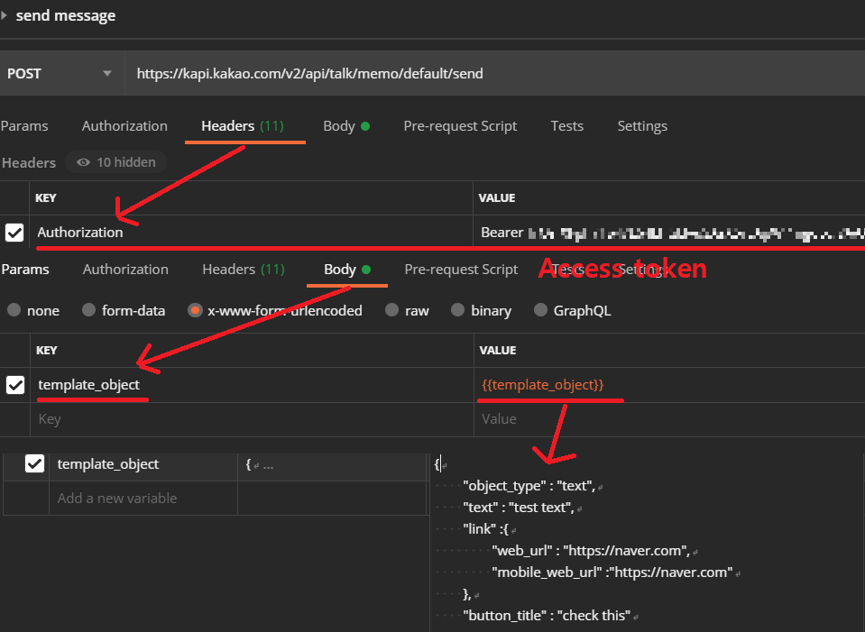
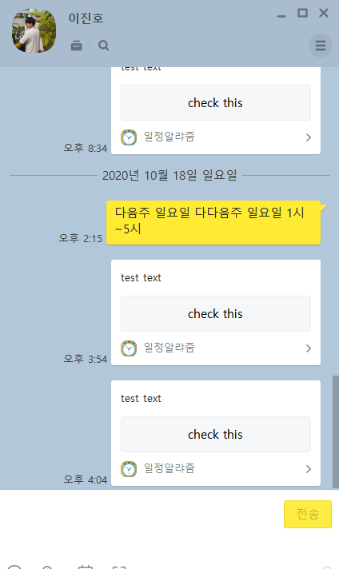

# 카카오 Developer 이용해서 나에게 메시지 보내기 3 - 나에게 기본 메시지 보내기

1. 나에게 기본 메시지 보내기

   * 현재 로그인한 카카오계정에 연결된 카카오톡을 통해 나에게 메시지를 보내는 기능이다. 이 기능으로 다른 사용자에게 메시지를 보낼수 없다.

   * Access token를 헤더에 담고 template_object를 파라미터로 구성하여 POST로 전달한다.

   * 일단 Postman으로 테스트

     

   * 
     * 성공!

